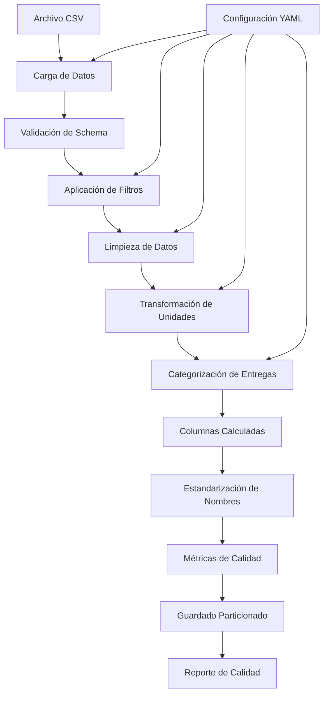

# Flujo de Datos - ETL de Entregas de Productos

## Resumen Ejecutivo

Este documento describe el flujo completo de datos para el procesamiento de entregas de productos, implementado con PySpark y configuración flexible usando OmegaConf. El sistema procesa datos de entregas aplicando filtros, transformaciones y validaciones de calidad para generar datasets analíticos particionados.

## Arquitectura del Sistema



## Flujo Detallado de Procesamiento

### 1. Carga de Datos (Data Loading)

**Entrada:**
- Archivo CSV con datos de entregas de productos
- Configuración de conexión y formato

**Proceso:**
```python
# Schema definido para validación
schema = StructType([
    StructField("pais", StringType(), True),
    StructField("fecha_proceso", StringType(), True),
    StructField("transporte", StringType(), True),
    StructField("ruta", StringType(), True),
    StructField("tipo_entrega", StringType(), True),
    StructField("material", StringType(), True),
    StructField("precio", DoubleType(), True),
    StructField("cantidad", DoubleType(), True),
    StructField("unidad", StringType(), True)
])
```

**Validaciones:**
- Verificación de existencia del archivo
- Validación de schema y tipos de datos
- Conteo inicial de registros

**Salida:**
- DataFrame de PySpark con datos crudos
- Reporte inicial de calidad

### 2. Aplicación de Filtros (Data Filtering)

**Filtros Configurables:**

#### 2.1 Filtro Temporal
```python
# Conversión de fecha_proceso (YYYYMMDD) a date
df = df.withColumn('fecha_proceso_date', to_date(col('fecha_proceso'), 'yyyyMMdd'))

# Aplicación de rango de fechas
df = df.filter(
    (col('fecha_proceso_date') >= lit(start_date)) &
    (col('fecha_proceso_date') <= lit(end_date))
)
```

#### 2.2 Filtro Geográfico
```python
# Filtro por países (configurable)
if countries:
    df = df.filter(col('pais').isin(countries))
```

#### 2.3 Filtro de Tipos de Entrega
```python
# Solo tipos de entrega válidos (ZPRE, ZVE1, Z04, Z05)
valid_types = routine_types + bonus_types  # Excluye COBR
df = df.filter(col('tipo_entrega').isin(valid_types))
```

### 3. Limpieza de Datos (Data Cleaning)

**Reglas de Limpieza:**

#### 3.1 Materiales Vacíos
```python
# Eliminar registros con material vacío o nulo
df = df.filter(
    col('material').isNotNull() &
    (col('material') != "") &
    (trim(col('material')) != "")
)
```

#### 3.2 Precios Inválidos
```python
# Eliminar precios cero o en notación científica
df = df.filter(
    col('precio').isNotNull() &
    (col('precio') > 0) &
    ~col('precio').rlike(r'^\d+E-\d+$')
)
```

#### 3.3 Cantidades Inválidas
```python
# Eliminar cantidades negativas o cero
df = df.filter(col('cantidad') > 0)
```

### 4. Transformación de Unidades (Unit Transformation)

**Normalización CS → Unidades:**

```python
# 1 CS (Caja) = 20 unidades
df = df.withColumn(
    'cantidad_normalizada',
    when(upper(col('unidad')) == 'CS', col('cantidad') * 20)
    .otherwise(col('cantidad'))
).withColumn(
    'unidad_normalizada',
    lit('units')
)
```

**Lógica de Negocio:**
- CS (Cajas): Se multiplican por 20
- ST (Unidades): Se mantienen igual
- Resultado: Todas las cantidades en la misma unidad (unidades)

### 5. Categorización de Entregas (Delivery Categorization)

**Clasificación por Tipo:**

```python
# Categorización según reglas de negocio
df = df.withColumn(
    'es_entrega_rutina',
    when(col('tipo_entrega').isin(['ZPRE', 'ZVE1']), lit(1)).otherwise(lit(0))
).withColumn(
    'es_entrega_bonificacion',
    when(col('tipo_entrega').isin(['Z04', 'Z05']), lit(1)).otherwise(lit(0))
).withColumn(
    'categoria_entrega',
    when(col('tipo_entrega').isin(['ZPRE', 'ZVE1']), lit('RUTINA'))
    .when(col('tipo_entrega').isin(['Z04', 'Z05']), lit('BONIFICACION'))
    .otherwise(lit('OTRO'))
)
```

**Tipos de Entrega:**
- **RUTINA**: ZPRE (Pre-autorizada), ZVE1 (Verificada)
- **BONIFICACION**: Z04, Z05 (Con bonificaciones)
- **EXCLUIDOS**: COBR (Contra reembolso)

### 6. Columnas Calculadas (Calculated Columns)

**Métricas Adicionales:**

#### 6.1 Valor Total
```python
df = df.withColumn(
    'valor_total',
    round(col('precio') * col('cantidad_normalizada'), 2)
)
```

#### 6.2 Score de Calidad
```python
df = df.withColumn(
    'score_calidad_datos',
    when(col('material').isNotNull() & (col('material') != ""), 1).otherwise(0) +
    when(col('precio') > 0, 1).otherwise(0) +
    when(col('cantidad_normalizada') > 0, 1).otherwise(0) +
    when(col('pais').isNotNull(), 1).otherwise(0) +
    when(col('ruta').isNotNull(), 1).otherwise(0)
)
```

#### 6.3 Metadatos de Procesamiento
```python
# Timestamp de procesamiento
df = df.withColumn('fecha_procesamiento', current_timestamp())

# ID único para cada registro
df = df.withColumn('id_registro', monotonically_increasing_id())

# Dimensiones temporales
df = df.withColumn('año_proceso', date_format(col('fecha_proceso_date'), 'yyyy'))
df = df.withColumn('mes_proceso', date_format(col('fecha_proceso_date'), 'MM'))
```

### 7. Estandarización de Nombres (Column Standardization)

**Mapeo de Nombres:**

| Columna Original | Columna Estandarizada | Descripción |
|------------------|----------------------|-------------|
| `pais` | `pais_codigo` | Código del país |
| `fecha_proceso` | `fecha_proceso_original` | Fecha original (string) |
| `fecha_proceso_date` | `fecha_proceso` | Fecha parseada (date) |
| `transporte` | `codigo_transporte` | Código de transporte |
| `ruta` | `codigo_ruta` | Código de ruta |
| `tipo_entrega` | `tipo_entrega_codigo` | Código de tipo de entrega |
| `material` | `codigo_material` | Código del material |
| `precio` | `precio_unitario` | Precio por unidad |
| `cantidad` | `cantidad_original` | Cantidad original |
| `unidad` | `unidad_original` | Unidad original |
| `cantidad_normalizada` | `cantidad_unidades` | Cantidad en unidades |
| `unidad_normalizada` | `unidad_estandar` | Unidad estándar |

### 8. Generación de Métricas de Calidad

**Métricas Calculadas:**

```python
metrics = {
    'total_records': df.count(),
    'unique_countries': df.select('pais_codigo').distinct().count(),
    'unique_materials': df.select('codigo_material').distinct().count(),
    'date_range': {
        'min_date': df.agg({'fecha_proceso': 'min'}).collect()[0][0],
        'max_date': df.agg({'fecha_proceso': 'max'}).collect()[0][0]
    },
    'delivery_categories': df.groupBy('categoria_entrega').count().collect(),
    'value_statistics': {
        'total_value': df.agg(sum('valor_total_calculado')).collect()[0][0],
        'average_value': df.agg(mean('valor_total_calculado')).collect()[0][0]
    }
}
```

### 9. Guardado Particionado (Partitioned Storage)

**Estrategia de Particionado:**

```python
# Particionado por fecha_proceso para optimización de consultas
df.write \
  .mode('overwrite') \
  .partitionBy('fecha_proceso') \
  .parquet(output_path)
```

**Estructura de Salida:**
```
data/processed/
├── fecha_proceso=20250114/
│   ├── part-00000-xxx.parquet
│   └── part-00001-xxx.parquet
├── fecha_proceso=20250217/
│   ├── part-00000-xxx.parquet
│   └── part-00001-xxx.parquet
└── fecha_proceso=20250513/
    ├── part-00000-xxx.parquet
    └── part-00001-xxx.parquet
```

## Schema del Dataset Final

### Columnas de Salida

```sql
CREATE TABLE entregas_productos_procesadas (
    -- Identificadores
    id_unico_registro       BIGINT,
    pais_codigo            STRING,
    codigo_transporte      STRING,
    codigo_ruta           STRING,
    codigo_material       STRING,
    
    -- Fechas
    fecha_proceso         DATE,
    fecha_proceso_original STRING,
    timestamp_procesamiento TIMESTAMP,
    anio_proceso          STRING,
    mes_proceso           STRING,
    
    -- Datos de entrega
    tipo_entrega_codigo   STRING,
    categoria_entrega     STRING,
    es_entrega_rutina     INT,
    es_entrega_bonificacion INT,
    
    -- Cantidades y precios
    precio_unitario       DOUBLE,
    cantidad_original     DOUBLE,
    unidad_original       STRING,
    cantidad_unidades     DOUBLE,
    unidad_estandar       STRING,
    valor_total_calculado DOUBLE,
    
    -- Calidad
    score_calidad_datos   INT
)
PARTITIONED BY (fecha_proceso DATE)
```

## Reglas de Negocio Implementadas

### 1. Normalización de Unidades
- **CS (Cajas)**: 1 CS = 20 unidades
- **ST (Unidades)**: 1 ST = 1 unidad
- **Resultado**: Todas las cantidades en unidades estándar

### 2. Clasificación de Entregas
- **Entregas de Rutina**: ZPRE, ZVE1
- **Entregas con Bonificación**: Z04, Z05
- **Entregas Excluidas**: COBR (no procesadas)

### 3. Limpieza de Datos
- Eliminar materiales vacíos o nulos
- Eliminar precios ≤ 0 o en notación científica
- Eliminar cantidades ≤ 0
- Mantener solo tipos de entrega válidos

### 4. Validaciones de Calidad
- Score de calidad por registro (0-5)
- Métricas agregadas de procesamiento
- Detección de anomalías automática

## Configuración Parametrizable

### Archivo de Configuración (YAML)

```yaml
data:
  filters:
    start_date: "2025-01-01"    # Configurable
    end_date: "2025-12-31"      # Configurable
    countries: ["GT", "PE"]     # Lista o null para todos
  
transformations:
  unit_conversion:
    cs_to_units_multiplier: 20  # Configurable
  
  delivery_types:
    routine: ["ZPRE", "ZVE1"]   # Configurable
    bonus: ["Z04", "Z05"]       # Configurable
    exclude: ["COBR"]           # Configurable
  
  data_cleaning:
    remove_empty_materials: true      # Configurable
    remove_zero_prices: true          # Configurable
    remove_negative_quantities: true  # Configurable
```

### Overrides desde CLI

```bash
# Filtrar por rango de fechas específico
python main.py run --start-date 2025-01-01 --end-date 2025-06-30

# Procesar solo un país
python main.py run --country GT

# Procesar múltiples países
python main.py run --countries GT,PE,EC
```

## Métricas de Rendimiento

### Optimizaciones Implementadas

1. **Particionado**: Por fecha_proceso para consultas eficientes
2. **Columnar Storage**: Formato Parquet para compresión y velocidad
3. **Spark Adaptive Query Execution**: Habilitado por defecto
4. **Schema Enforcement**: Validación temprana de tipos de datos

### Benchmarks Esperados

| Volumen de Datos | Tiempo de Procesamiento | Memoria Requerida |
|------------------|------------------------|-------------------|
| 10K registros    | < 30 segundos          | 2GB               |
| 100K registros   | < 2 minutos            | 4GB               |
| 1M registros     | < 10 minutos           | 8GB               |

## Monitoreo y Alertas

### Métricas de Calidad Monitoreadas

1. **Completitud**: % de registros sin valores nulos
2. **Validez**: % de registros que pasan validaciones
3. **Consistencia**: Coherencia entre campos relacionados
4. **Unicidad**: Detección de duplicados
5. **Precisión**: Valores dentro de rangos esperados

### Alertas Configuradas

```python
# Ejemplo de reglas de alerta
alerts = {
    'data_quality_score_avg': {'threshold': 4.0, 'operator': '<'},
    'records_dropped_pct': {'threshold': 20.0, 'operator': '>'},
    'processing_time_minutes': {'threshold': 15.0, 'operator': '>'},
    'unique_countries': {'threshold': 3, 'operator': '<'}
}
```

## Casos de Uso y Consultas

### 1. Análisis por País
```sql
SELECT 
    pais_codigo,
    COUNT(*) as total_entregas,
    SUM(valor_total_calculado) as valor_total,
    AVG(valor_total_calculado) as valor_promedio
FROM entregas_productos_procesadas 
WHERE fecha_proceso BETWEEN '2025-01-01' AND '2025-06-30'
GROUP BY pais_codigo
ORDER BY valor_total DESC;
```

### 2. Comparación Rutina vs Bonificación
```sql
SELECT 
    categoria_entrega,
    COUNT(*) as cantidad_entregas,
    SUM(cantidad_unidades) as unidades_totales,
    SUM(valor_total_calculado) as valor_total
FROM entregas_productos_procesadas 
GROUP BY categoria_entrega;
```

### 3. Tendencias Temporales
```sql
SELECT 
    anio_proceso,
    mes_proceso,
    COUNT(*) as entregas_mes,
    SUM(valor_total_calculado) as valor_mes
FROM entregas_productos_procesadas 
GROUP BY anio_proceso, mes_proceso
ORDER BY anio_proceso, mes_proceso;
```

## Escalabilidad y Evolución

### Diseño Escalable

1. **Horizontal**: Añadir más workers de Spark
2. **Vertical**: Incrementar memoria y CPU por worker
3. **Particionado**: Adicionar particiones por país si crece el volumen
4. **Streaming**: Migrar a Spark Streaming para procesamiento en tiempo real

### Roadmap de Mejoras

1. **Fase 1 (Actual)**: ETL batch con configuración flexible
2. **Fase 2**: Integración con Delta Lake para versionado
3. **Fase 3**: Streaming en tiempo real con Kafka
4. **Fase 4**: ML para detección automática de anomalías
5. **Fase 5**: Dashboard en tiempo real con métricas

## Troubleshooting Común

### Problemas y Soluciones

| Problema | Causa | Solución |
|----------|-------|----------|
| OutOfMemory | Dataset muy grande | Aumentar `spark.executor.memory` |
| Datos vacíos | Filtros muy restrictivos | Revisar configuración de filtros |
| Fechas inválidas | Formato incorrecto | Validar formato YYYYMMDD |
| Performance lenta | Falta de particionado | Verificar estrategia de particionado |

### Logs de Debugging

```python
# Habilitar logging detallado
python main.py run --verbose

# Revisar logs
tail -f logs/etl_process.log
```

## Conclusión

Este flujo de datos implementa un pipeline ETL robusto y flexible que transforma datos crudos de entregas en un dataset analítico de alta calidad. La arquitectura modular permite fácil mantenimiento y extensión, mientras que la configuración parametrizable facilita su adaptación a diferentes necesidades de negocio.

El sistema garantiza la calidad de datos mediante validaciones múltiples y genera métricas comprensivas para monitoreo continuo del proceso de transformación.